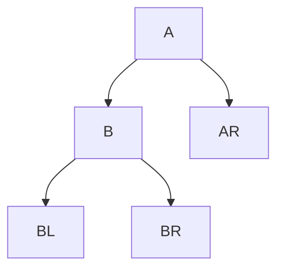
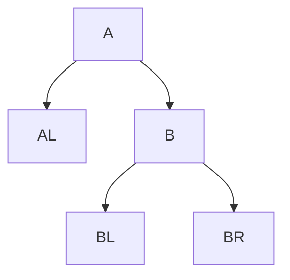

>由于在408中平衡二叉树代码考察的较少，故不实现代码，仅梳理内容。

平衡二叉树：树上任一结点的左子树和右子树的深度之差不超过1。平衡二叉树（Balanced Binary Tree），简称平衡树（AVL树）。

结点的平衡因子：左子树高 - 右子树高

```cpp
typedef struct AVLNode {
	int key;
	int balance;
	struct AVLNode *lchild, *rchild;
}AVLNode, *AVLTree;
```


每次调整的都是**最小不平衡子树**。

- `LL`：在A的左子树的左子树插入导致不平衡



将`B`右旋代替`A`结点，`A`成为`B`的右孩子，`BR`成为`A`的左孩子

- `RR`：在A的右孩子的右子树插入导致不平衡



将`B`左旋代替`A`结点，`A`成为`B`的左孩子，`BL`成为`A`的右孩子

- `LR`：在A的左孩子的右孩子插入导致不平衡

先左旋，再右旋

- `RL`：在A的右孩子的左孩子插入导致不平衡

先右旋，再左旋


**左孩子右旋，右孩子左旋。**


假设以$n_h$表示深度为$h$的平衡树中含有的最少结点数
$$
n_h = n_{h - 1} + n_{h - 2} + 1 \\
n_0 = 0 \\
n_1 = 1 \\
n_2 = 2
$$


