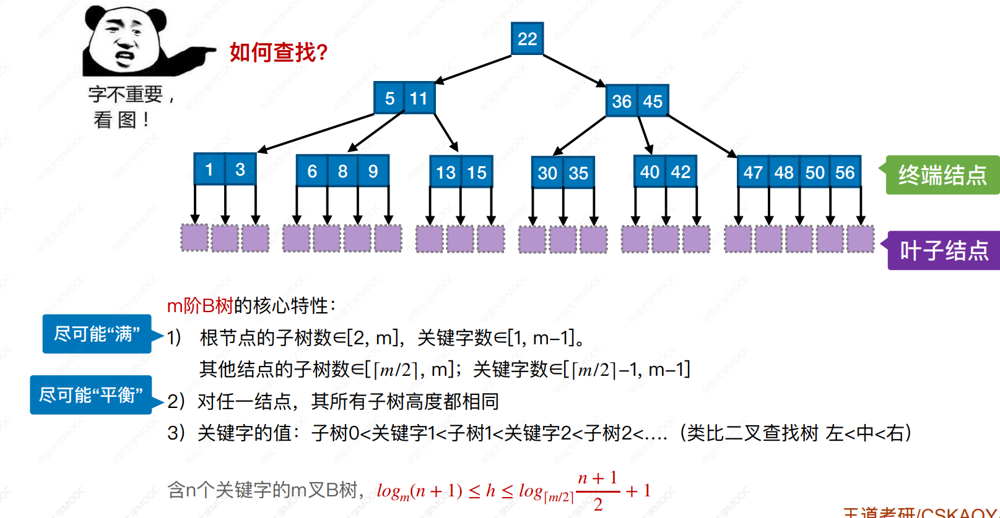

m叉树中，规定除了根节点外，任何结点至少有$\lceil \frac {m} {2} \rceil$个分叉，即至少含有$\lceil \frac m 2 \rceil - 1$个关键字

# B树

```cpp
# 5阶B树
struct Node {
	ElemType keys[4];
	struct Node *child[5];
	int num;
}
```



B树，又叫多路平衡查找树。B树中所被允许的孩子个数的最大值称为B树的阶。

一颗$m$阶B树或空，或满足：

- 树中每个结点至多有$m$棵子树，即至多含有$m - 1$个关键字
- 若根节点不是终端结点，则至少有两颗子树
- 除根节点外的所有非空叶结点至少有$\lceil \frac m 2 \rceil$棵子树，即至少$\lceil \frac {m} {2} \rceil - 1$个关键字
- 所有叶结点在同一层，不含信息，为失败结点

> 注意：叶结点，失败结点，终端结点


- 根节点子树$[2, m]$，关键字$[1, m - 1]$
- 其他结点子树$[ \rceil \frac m 2 \rceil, m]$，关键字$[ \lceil \frac m 2 \rceil - 1, m - 1]$
- 任一结点，子树高度相同


最小高度：尽可能每个结点填满：$h \gt log_{m}(n + 1)$

最大高度：尽可能只满足至少的情况：$h \lt log_{\lceil \frac m 2 \rceil}(\frac {n + 1} 2) + 1$


## 插入

1. 通过查找确定插入位置（**一定在终端结点**）
2. - 入后没有超出，结束
   - 将中间$[\lceil \frac m 2 \rceil]$的元素放到父节点，继续操作2


## 删除

### 非终端结点

用其直接前驱或直接后继代替，转为对终端结点的删除

- 直接前驱：左子树最右
- 直接后继：右子树最左

### 终端结点

删除后不低于下线，结束

- 右孩子借，用与当前结点的后继，后继的后继顶替空缺
- 左                                            前驱 前驱的前驱
- 左右兄弟都不够借，跟左/右兄弟合并，合并后父关键字减一，继续判定

