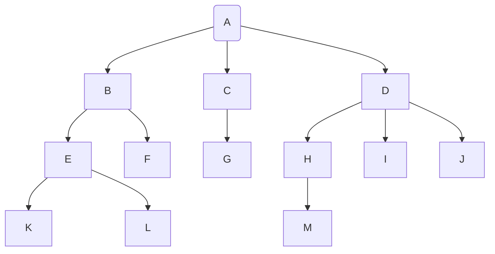

空树：结点数为0的树

非空树：

- 有且仅有一个根结点
- 没有后继的结点称为 叶子结点
- 有后继的结点称为 分支结点
- 除根节点外，任何一个结点都有且仅有一个前驱
- 每个结点可能有0个或多个后继

祖先/子孙结点：

双亲/孩子结点：

兄弟结点： K和L是兄弟结点

堂兄弟结点：双亲在同一层的结点互为堂兄弟。EFGHIJ互为堂兄弟

结点的度：结点的孩子个数

树的度：树中结点的最大度数

**结点的层数可能从1开始，也可能从0开始，注意看题目要求。**

结点的深度：结点所在的层次

树的高度：树中结点的最大层数

有序树/无序树：

路径和路径长度：

森林：

## 树的性质

> 树的度为m，表示一定存在一个结点的度是m。
>
> m叉树，表示每个结点最多可以有m个孩子。
>
> **两者不同。**

| 度为m的树                         | m叉树                  |
| --------------------------------- | ---------------------- |
| 任意结点的度 <= m                 | 任意结点的度 <= m      |
| 至少有一个结点的度为m             | 允许所有结点的度都 < m |
| 一定是非空树，至少有 m + 1 个结点 | 可以是空树             |

- 树的总结点数为总度数之和  + 1
- 度为m的树中第$i$层至多有$ m ^{i - 1}$ 个结点
- 高度为$h$的$m$叉树至多有$\frac{m^h - 1}{m - 1}$个结点
- 度为$m$，高度为$h$至少有$h + m - 1$个结点
- 具有$n$个结点$m$叉树的最小高度为$\lceil {log_{m}{(n(m - 1)  + 1)}\rceil}$